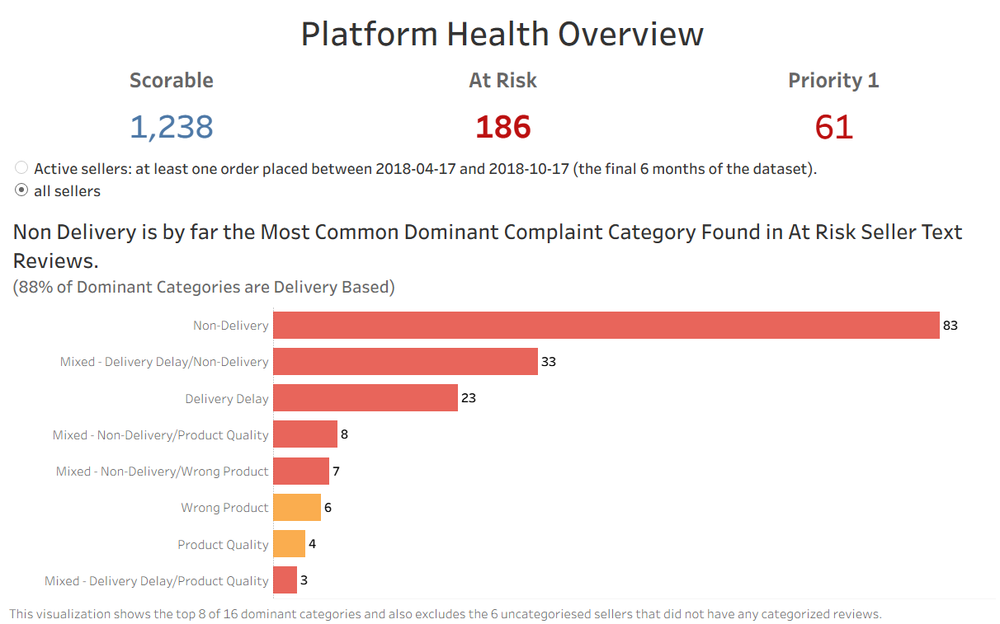
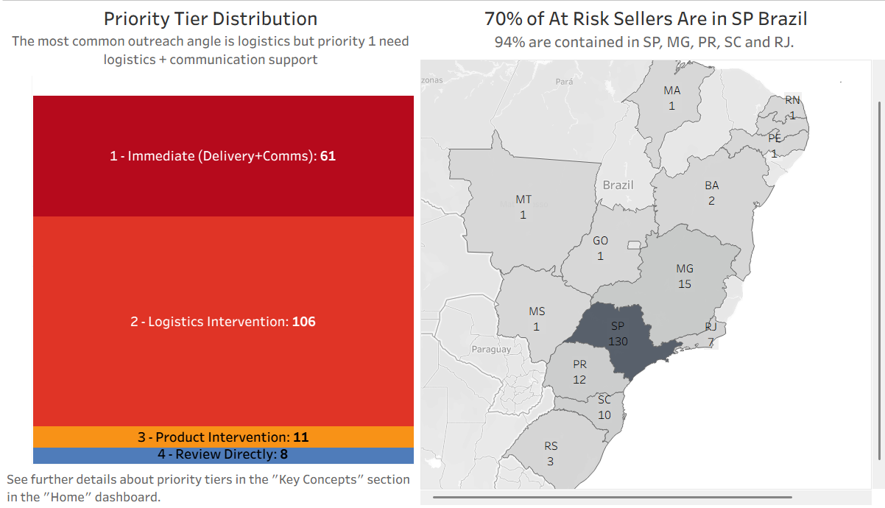

# Olist Seller Risk Monitor

**Identifying sellers who are eroding platform reputation on Olist's shared-brand marketplace, and characterising what "poor performance" actually looks like — so Seller Success can intervene before it costs Olist a customer.**

> **TL;DR:** Of 1,238 sellers with enough order history to score reliably, **186 (15.0%) are flagged At Risk**. Delivery failure — not product quality — is the dominant cause. **61 of those sellers show a compound delivery + communication failure and are recommended for immediate outreach.**

🔗 **[View the live interactive dashboard on Tableau Public](https://public.tableau.com/app/profile/sam.walker3838/viz/OlistSellerRiskMonitor/Home)**

<!-- REVIEW: confirm this Tableau Public link stays stable after any future workbook republish — Tableau Public sometimes changes the URL slug if the workbook name is edited after publishing. -->

---

## Table of Contents

**Project Results**
1. [Project Overview](#1-project-overview)
2. [Data Structure Overview](#2-data-structure-overview)
3. [Executive Summary](#3-executive-summary)
4. [Insights Deep Dive](#4-insights-deep-dive)
5. [Recommendations](#5-recommendations)

**Project Methodology**
6. [Methodology Overview](#6-methodology-overview)
7. [Repository Structure](#7-repository-structure)
8. [Data Source](#8-data-source)
9. [Technical Stack](#9-technical-stack)
10. [How to Reproduce](#10-how-to-reproduce)
11. [Limitations and Caveats](#11-limitations-and-caveats)
12. [AI Tool Usage](#12-ai-tool-usage)

---

## 1. Project Overview

Olist is a Brazilian marketplace integrator: small and medium sellers list under a single shared brand, "Olist Store," across major Brazilian marketplaces like Mercado Livre. That shared brand is a double-edged sword — one seller who repeatedly fails to deliver damages the reputation of every seller on the platform, because the customer never knows which individual seller they bought from.

As a data analyst on the Seller Success team, I was asked by the Head of Operations to find the sellers doing that damage — and to describe, in specific and actionable terms, what "poor performance" looks like — so the team can reach out before a pattern of failure turns into a wave of cancelled orders and public reviews. This project builds a seller health scoring system, segments underperforming sellers by their dominant failure mode, and prioritises them for outreach.

---

## 2. Data Structure Overview

Before the findings, a short glossary — these terms recur throughout the analysis and the dashboard.

**Health Score (0–100, higher = healthier).** A weighted, percentile-based composite of four seller-level metrics: average review score (40%), late order rate (28%), one-star review rate (22%), and average delivery time (10%). Only sellers with 10+ delivered orders and a non-null review score are scored (1,238 of 2,970 total sellers — the "scoreable population"). See [Section 6](#6-methodology-overview) for why percentile ranking was chosen and why the weights are set this way.

**Risk Tiers.** Sellers are split into three bands by health score: **At Risk** (score < 23.0, 186 sellers), **Monitor** (23.0–43.0, 309 sellers), **Healthy** (> 43.0, 743 sellers). Thresholds were set from the shape of the score distribution, not an arbitrary round number — see Section 6.

**Complaint Categories.** For At Risk sellers only, negative (1–2 star) reviews with written comments were classified into six failure modes using Portuguese keyword matching: *Non-Delivery, Delivery Delay, Wrong Product, Product Quality, Poor Communication, Poor Packaging*. A seller's **dominant category** is their most frequent classified complaint type.

**Flags.** Three binary indicators layered on top of the score: **extreme_late_flag** (at least one order delivered 30+ days late), **delivery_comms_compound** (a seller shows both delivery failure and communication-failure complaints — the most damaging combination observed), and **low_review_coverage** (fewer than 3 categorised reviews — treat that seller's profile as directional, not conclusive).

**Intervention Priority (1–4).** The action-oriented output of the whole pipeline: Priority 1 (Immediate — delivery + communications compound failure), Priority 2 (Logistics Intervention), Priority 3 (Product Intervention), Priority 4 (Review Directly — usually low-coverage sellers who need a human look rather than a rule-based label).

**Why this matters operationally:** Olist's own review economics make the stakes concrete. Platform-wide, delivery lateness is not a small drag on scores — it's a threshold effect. Review scores hold steady at 4.24–4.33 across every early-delivery bucket, then collapse to 3.18 the moment an order goes 0–7 days late, and to roughly 1.6–1.75 once it passes 7 days late. A late order isn't a slightly worse experience; it's a categorically different one. That's the mechanism this whole project is built to catch early.

---

## 3. Executive Summary

*For: Head of Operations*

**186 sellers (15.0% of the 1,238 sellers we can reliably score) are classified At Risk** — meaning their combination of review scores, late delivery rate, one-star rate, and delivery speed places them in the bottom performance band on the platform.

  
*Platform Health Overview — Head of Operations view. Non-Delivery is the single largest dominant failure mode (83 sellers); 88% of dominant categories are delivery-based.*

<!-- REVIEW: this screenshot currently shows "all sellers" toggled rather than "active sellers (last 6 months)" — decide which state is more representative to lead with, since the two toggle states will show different At Risk / Priority 1 counts. -->

**Delivery is the problem, not product quality.** Roughly three-quarters of At Risk sellers have a delivery-related dominant complaint (Non-Delivery, Delivery Delay, or a mixed delivery pattern), versus a minority driven primarily by product issues. Specifically:

- **Non-Delivery** (customer never received the item, or received only part of the order): 83 sellers (44.6% of At Risk) — the single largest failure mode.
- **Delivery Delay**: 23 sellers (12.4%) outright, plus 33 more (17.7%) with a mixed delay/non-delivery pattern.
- Delivery Delay sellers, while fewer in number than Non-Delivery sellers, are actually the **worst performers by health score** (mean 10.30 vs. 13.59 for Non-Delivery sellers) — late-but-arriving is, on this data, marginally worse for score than never-arriving-at-all-as-classified, which is a useful nuance for how outreach messaging should differ between these two groups.

**The most damaging pattern is delivery failure combined with poor communication.** 61 sellers (32.8% of At Risk) show both a delivery-related complaint and a communication-related complaint in the same review base. These sellers have a materially lower mean health score (12.2) than non-compound At Risk sellers (14.1). This is the segment we recommend for **immediate, white-glove outreach** — it's flagged as Intervention Priority 1.

**Product-quality failures are a smaller but distinct problem.** Wrong Product sellers post the highest one-star rate of any category (27.93%) but the *lowest* late-order rate (8.52%) — confirming these are genuinely product/fulfilment-accuracy issues, not a logistics problem wearing a different label. This group needs a different playbook: SKU/inventory accuracy support, not carrier or shipping-window coaching.

**Geographically, risk is concentrated where seller volume is concentrated.** 130 of the 186 At Risk sellers (70%) are based in São Paulo state — unsurprising given SP's dominant share of Olist's seller base, but it does mean outreach capacity should be planned around SP, not spread evenly by state.

  
*Priority tier breakdown (61 / 106 / 11 / 8) alongside geographic distribution of At Risk sellers — 94% of At Risk sellers fall within just five states (SP, MG, PR, SC, RJ).*

**Recommended immediate action:** Prioritise outreach to the 61 Priority-1 sellers (delivery + communications compound failure) this cycle; use the At Risk Seller Explorer dashboard to work the Priority 2 (Logistics, 106 sellers) and Priority 3 (Product, 11 sellers) queues afterward. Treat the 8 Priority-4 sellers and the 68 sellers flagged `low_review_coverage` as needing manual review rather than an automated message, since the evidence base behind their profile is thin.

---

## 4. Insights Deep Dive

### 4.1 Why delivery, and not reviews or price, drives the risk signal

Four questions were answered in the EDA phase to establish what actually predicts a bad review, before any seller-level scoring was attempted — this ordering matters: you don't build a health score around a weak signal.

- Platform review scores are heavily right-skewed: 57.8% five-star, 11.5% one-star, weighted average 4.09. This is broadly consistent with Olist's own dataset documentation, which cites an average review score of ~4.04 — the small difference reflects how the two figures were computed (raw mean vs. weighted average over the analytical universe), and both point to the same conclusion: most customers are satisfied, so **the signal worth chasing is the minority who are not**, which is why the one-star rate is tracked as its own metric rather than folded silently into an average.
- 91.89% of orders arrive **before** the estimated delivery date, with a median order arriving nearly 12 days early. This isn't sellers over-performing — Olist sets deliberately generous delivery windows (average estimate 23.74 days vs. average actual delivery of 12.56 days, an 11-day buffer). That buffer strategy matters for interpretation: it means "late" in this dataset is a meaningfully bad outcome relative to a promise Olist already padded, not a marginal miss.
- The relationship between delay and review score is statistically real but modest in raw correlation terms — Spearman ρ = -0.1757 (delay vs. score) and ρ = -0.2344 (absolute delivery days vs. score), both p < 0.0001. Under Cohen's (1988) original convention for interpreting correlation coefficients (r ≈ 0.1 small, 0.3 medium, 0.5 large), these sit at the small end. But a Spearman correlation assumes a roughly linear, sliding relationship — and that's not what's happening here.
- The Mann-Whitney U test comparing late vs. on-time/early orders tells a sharper story: rank-biserial effect size of -0.5534, which crosses the "large effect" threshold under the standard convention for this statistic (|r| > 0.5 = large). In plain terms, there's a 77.7% probability that a randomly chosen early order has a higher review score than a randomly chosen late order. **This is a threshold effect, not a dial** — scores are flat and high across every early-delivery bucket, then step down hard once an order crosses into "late." That's why the health score design leans on *late order rate* rather than average delay magnitude: rate captures how often a seller crosses the threshold that actually moves reviews, while an average delay number gets diluted by the 92% of orders that were never late to begin with.

### 4.2 Why the health score is built the way it is

The score population itself required a judgment call. Seller order volume is heavily right-skewed (median 7 orders, mean 32.9 across 2,970 sellers with delivered orders), and 58.4% of sellers have fewer than 10 orders — too little history to trust a review-score average built on 2–3 data points. Setting the minimum threshold at 10 delivered orders shrinks the scoreable population to 1,238 sellers but makes every score defensible; the 1,732 excluded sellers aren't ignored, they're tracked separately (`seller_excluded.csv`) as a distinct "insufficient history" segment.

Percentile ranking (rather than z-scores or min-max scaling) was chosen for the same reason the one-star rate is tracked separately from the average: several of the input metrics are skewed, and percentile rank is robust to that skew while staying easy to explain to a non-technical stakeholder ("this seller is worse than 85% of comparable sellers" is intuitive in a way a z-score of -1.3 is not).

`pct_extreme_late` (share of a seller's orders more than 30 days late) was pulled out of the weighted score entirely, because 83.4% of sellers have zero extreme-late orders — percentile ranking a metric that's zero for five out of six sellers doesn't discriminate between them, it just adds noise. It survives instead as a standalone binary flag, which is arguably more useful operationally anyway: "has this seller ever had a catastrophic delivery failure" is a yes/no question, not a spectrum.

The resulting weights (review score 40%, late rate 28%, one-star rate 22%, delivery days 10%) were stress-tested with a sensitivity analysis across alternative weight configurations: 91.3% of sellers land in the same tier regardless of which configuration is used, 87.6% stability specifically within the At Risk tier, and critically, **no seller ever jumps between At Risk and Healthy** across configurations — the worst instability observed is a seller shifting into or out of the adjacent Monitor tier. That's the standard a scoring system needs to clear before it's trusted for something as consequential as flagging a seller for intervention: the boundary cases (108 sellers, 8.7%, flagged `boundary_case_flag`) are known and named, not hidden.

### 4.3 What the complaint text actually says

Six complaint categories were built from keyword matching against Portuguese review text for 2,328 negative (1–2 star) reviews from the 186 At Risk sellers, and refined iteratively: each category's precision was checked by manually translating a 10-review sample and validating against a 70% precision bar before it was accepted.

| Category | Precision | Confidence |
|---|---|---|
| Non-Delivery | 90% | High |
| Poor Communication | 90% | High |
| Delivery Delay | 80% | High |
| Wrong Product | 80% | High |
| Product Quality | 70% | Moderate |
| Poor Packaging | 70% | Moderate |

One refinement is worth calling out as a methods lesson: partial-delivery phrases ("só recebi," "recebi apenas" — "I only received") were initially bucketed under Wrong Product, but precision testing showed this was a systematic miscategorisation — those phrases describe an incomplete delivery, not a wrong item — and they were moved to Non-Delivery. That single fix materially changed which sellers looked like a "product" problem versus a "logistics" problem, which is exactly the kind of distinction that determines what an outreach message should say.

40% of negative reviews remain uncategorised — predominantly short emotional text ("péssimo," "horrível") with no diagnostic content, or reviews where the score doesn't match the sentiment of the text at all. This is discussed further in [Limitations](#11-limitations-and-caveats); it's a real ceiling on precision, not a bug to hide.

Delivery-related complaints (Non-Delivery + Delivery Delay, deduplicated) account for 977 of the 1,397 categorised reviews (69.9%); product-related complaints (Wrong Product + Product Quality) account for 393 (28.1%). The average categorised review carries 1.5+ complaint categories — most dissatisfied customers aren't citing one isolated problem, they're describing a compounding bad experience.

Here's what that looks like at the individual-seller level — the rank-1 (lowest health score) At Risk seller, pulled from the Seller Profile dashboard:


*Seller Profile for the platform's lowest-scoring seller — every metric benchmarked against the full 97,917-order platform average, with a rule-based recommended intervention generated automatically from the seller's flags and dominant category.*

<!-- REVIEW: double-check the "Recommended Intervention" text logic (CASE statement in notebook 06/Tableau calc) still reads naturally for every priority tier, not just Priority 1 — proofread the Priority 3 and 4 text specifically since those were written last. -->

---

## 5. Recommendations

1. **Stand up a tiered outreach cadence starting with the 61 Priority-1 sellers.** These are the delivery + communication compound-failure sellers — the segment with both the worst mean health score (12.2) and the clearest evidence of a controllable root cause (communication is fixable without new logistics infrastructure). Recommend a direct account-manager call, not an automated email, given the stakes.

2. **Split the Priority-2 logistics queue (106 sellers) by dominant sub-pattern.** Non-Delivery and Delivery Delay sellers likely need different interventions — Non-Delivery may point to inventory/fulfilment failures upstream of shipping, while Delivery Delay (the lower-scoring group, mean 10.30) more plausibly needs carrier or shipping-window coaching. Recommend the team validate this split with a small sample of direct seller conversations before scripting outreach.

3. **Route the 11 Priority-3 (Wrong Product) sellers to a fulfilment-accuracy check, not a shipping conversation.** Their low late-order rate (8.52%) alongside a high one-star rate (27.93%) rules out logistics as the driver — this is a picking/packing/listing-accuracy problem.

4. **Treat the 68 `low_review_coverage` sellers and 8 Priority-4 sellers as a manual-review queue, not an automated-message queue.** Fewer than 3 categorised reviews isn't enough to script confident messaging; a Seller Success rep should read the raw reviews before reaching out.

5. **Use the `extreme_late_flag` (45 sellers, 24.2% of At Risk) as an escalation trigger independent of tier.** A single 30+ day delivery is the kind of event likely to generate a public, highly visible complaint regardless of a seller's overall average — this flag exists precisely so it isn't averaged away.

6. **Re-run this scoring pipeline on a regular cadence (recommend quarterly) rather than treating it as a one-off snapshot.** The `orders_last_6_months` field is already built into the feature table specifically to support an "active seller" filter going forward — a seller who was At Risk a year ago but has gone quiet, or has since improved, shouldn't stay in an active outreach queue by default.

7. **Invest in improving the 40% uncategorised-review rate before scaling this to a fully automated triage system.** Keyword-based classification in a second language is a reasonable v1, but a properly evaluated sentiment/NLP model (or a lightweight human-review sample of the uncategorised bucket) would materially raise confidence in the complaint-category outputs used to drive the recommendations above.

---

## 6. Methodology Overview

```
01_setup/
  ├─ 01_create_schema.sql ─────────► PostgreSQL schema
  ├─ 02_load_data.ipynb   ─────────► Load 9 raw Kaggle CSVs
  ├─ 03_data_validation.sql ───────► Row counts, null checks, key integrity
  └─ 04_foreign_key_constraints.sql ► Enforce relational integrity
                    │
                    ▼
02_analysis/
  ├─ 05_EDA.ipynb ──────────────────► Q1–Q4: review distribution, seller volume,
  │                                    delivery delay, delay↔review relationship
  │                                    (establishes that delivery is the signal
  │                                     worth building a score around)
  │                                          │
  │                                          ▼
  ├─ 06_seller_feature_engineering.ipynb ──► SQL feature table (CTE-based, order-
  │                                          level pre-aggregation) → health_score,
  │                                          risk tier, flags
  │                                          │  outputs: seller_health_scores.csv
  │                                          │           seller_excluded.csv
  │                                          ▼
  └─ 07_review_text_analysis.ipynb ────────► Complaint categorisation (At Risk
                                              sellers only) → dominant_category,
                                              compound flags, intervention_priority
                                              outputs: at_risk_profiles_final.csv
                                                       at_risk_complaints_long.csv
                    │
                    ▼
dashboard/
  └─ seller_health_dashboard.twbx ─► 3 Tableau dashboards (Platform Overview,
                                      At Risk Seller Explorer, Seller Profile)
                                      + Home tab with glossary
```

Each notebook's output is the next notebook's input — the feature table in Notebook 06 depends on the delay/review relationship established in Notebook 05, and the complaint categorisation in Notebook 07 only runs against the At Risk sellers Notebook 06 identifies. The dashboard layer consumes the final processed CSVs only; it does not touch the database directly.

---

## 7. Repository Structure

```
Brazil_E-Commerce/
│
├── 01_setup/                          # Database schema, load, and validation
│   ├── 01_create_schema.sql           #   Table definitions
│   ├── 02_load_data.ipynb             #   CSV → PostgreSQL load
│   ├── 03_data_validation.sql         #   Row counts, null/key checks
│   └── 04_foreign_key_constraints.sql #   Referential integrity
│
├── 02_analysis/                       # Core analytical work
│   ├── 05_EDA.ipynb                   #   Platform-level exploratory analysis
│   ├── 06_seller_feature_engineering.ipynb  # Seller feature table + health score
│   └── 07_review_text_analysis.ipynb  #   Complaint categorisation (At Risk only)
│
├── dashboard/
│   └── seller_health_dashboard.twbx   # 3-dashboard Tableau workbook
│
├── data/
│   ├── raw/                           # 9 original Kaggle CSVs (untouched)
│   └── processed/
│       ├── seller_health_scores.csv       # 1,238 scoreable sellers: metrics,
│       │                                  #   score, tier, flags
│       ├── seller_excluded.csv            # 1,732 sellers below the 10-order
│       │                                  #   minimum
│       ├── at_risk_profiles_final.csv     # 186 At Risk sellers: complaint
│       │                                  #   profile, dominant category,
│       │                                  #   intervention priority
│       └── at_risk_complaints_long.csv    # Long-format categorised review data
│
├── .gitignore
├── AI_diligence_statement.txt         # AI tool usage disclosure (see Section 12)
├── GLOSSARY.md                        # Full definitions for score, tiers, flags
├── README.md                          # This file
└── notes.md                           # Working notes / scratchpad
```

---

## 8. Data Source

This project uses the **Olist Brazilian E-Commerce Public Dataset**, published on Kaggle by Olist and Kaggle user André Sionek. It comprises 9 relational CSV files covering ~100,000 orders placed on the Olist Store between **September 2016 and October 2018**, including order status and timestamps, item-level pricing and freight, customer and seller geography, product attributes, payments, and customer reviews.

- **Analytical universe for this project:** 97,917 orders with a complete chain of items, delivery data, and review (of 99,441 total orders in the raw dataset).
- **Date range confirmed in-data:** `order_purchase_timestamp` min 2016-09-04, max 2018-10-17.
- Review text has been anonymised by the dataset publisher — references to companies and delivery partners are replaced with *Game of Thrones* house names. This is intentional obfuscation by Olist, not missing or corrupted data, and is treated as such throughout the text analysis.

---

## 9. Technical Stack

| Layer | Tools |
|---|---|
| Database | PostgreSQL, managed via pgAdmin |
| Data prep / feature engineering | Python (pandas), SQL (CTE-based aggregation) |
| Statistical analysis | scipy (Spearman correlation, Mann-Whitney U, rank-biserial effect size) |
| Visualization (notebook-level) | matplotlib, seaborn |
| Review text analysis | Portuguese keyword-based classification; `deep-translator` for sample translation during precision evaluation |
| Dashboarding | Tableau Public (3 dashboards + home tab) |
| Environment | Jupyter Notebooks |

---

## 10. How to Reproduce

1. **Clone the repository** and install dependencies (`requirements.txt` — pandas, scipy, matplotlib, seaborn, deep-translator, psycopg2 or equivalent PostgreSQL driver).
2. **Set up the database:** run `01_setup/01_create_schema.sql` against a fresh PostgreSQL instance, then execute `02_load_data.ipynb` to load the 9 raw Kaggle CSVs (place them in `data/raw/` first — download from the Kaggle dataset page linked in [Section 8](#8-data-source)).
3. **Validate the load:** run `03_data_validation.sql` and `04_foreign_key_constraints.sql` to confirm row counts and referential integrity before analysis.
4. **Run the analysis notebooks in order:** `05_EDA.ipynb` → `06_seller_feature_engineering.ipynb` → `07_review_text_analysis.ipynb`. Each writes its outputs to `data/processed/`; Notebooks 06 and 07 depend on tables created in earlier steps, so run sequentially, not in parallel.
5. **Open the dashboard:** `dashboard/seller_health_dashboard.twbx` in Tableau Public or Tableau Desktop — it reads directly from the `data/processed/` CSVs, so steps 1–4 must be completed (with matching file paths) before the dashboard will refresh correctly.

---

## 11. Limitations and Caveats

This analysis is decision-support, not ground truth — the following should be read alongside any recommendation drawn from it:

- **40% of negative reviews are uncategorised.** These are predominantly short emotional expressions ("horrível," "péssimo") without diagnostic detail, or cases where the text sentiment doesn't obviously match the numeric score (idiomatic Portuguese, sarcasm, or a low score left with positive-sounding text). Sellers whose complaints skew toward this uncategorised bucket may have their dominant failure mode under-represented — this is why `low_review_coverage` exists as a separate flag, and why those profiles are marked directional rather than conclusive.
- **1,732 sellers (58.4% of the seller base) are excluded from scoring entirely** for having fewer than 10 delivered orders. This is a deliberate trade-off between coverage and reliability — a seller with 2 orders and 1 bad review would otherwise show a volatile, misleading score — but it does mean genuinely poor-performing very-low-volume sellers are currently invisible to this system. They're preserved in `seller_excluded.csv` for future work rather than dropped silently.
- **Complaint categorisation precision was validated on small samples (n=10 manually translated reviews per category).** Precision scores of 70–90% are a reasonable v1 confidence bar for prioritisation, not a claim of ground-truth accuracy at the individual-review level. A larger validation sample or a proper NLP/sentiment model would be a natural next iteration (see [Recommendations](#5-recommendations), item 7).
- **`avg_actual_delivery_days` is not purely a seller-controlled metric.** Brazil's geography means delivery time is partly a function of the physical distance between a seller (concentrated in the Southeast, particularly São Paulo) and a customer (spread more broadly, including harder-to-reach Northeast and North regions). A seller based far from most of their customer base will show a higher average delivery time for reasons outside their control. This metric carries the lowest weight in the health score (10%) partly for this reason, but it is not fully geography-adjusted, and that should be considered before using delivery-days alone to judge a seller.
- **Platform benchmarks shown in the Seller Profile dashboard come from the full analytical universe (97,917 orders), not from the 1,238-seller scoreable population.** This was a deliberate choice — the full dataset represents actual customer experience across the platform, which is the fairest yardstick for judging any individual seller — but it does mean a seller is being compared against a benchmark that includes both scoreable and excluded sellers.
- **This is observational, correlational analysis**, not a causal or experimental study. The delay→review relationship is well-established statistically ([Section 4.1](#41-why-delivery-and-not-reviews-or-price-drives-the-risk-signal)), but the health score is a diagnostic and prioritisation tool, not proof that any single flagged seller is behaving in bad faith — some may be dealing with circumstances (e.g., a bad carrier partner, a temporary supply issue) that outreach, not penalty, is the right response to.

---

## 12. AI Tool Usage

See `AI_diligence_statement.txt` for the full disclosure of where AI assistance was used in this project (e.g., code drafting support, README structuring) and where analytical decisions, validation, and interpretation were performed directly.

---

*Analysis conducted by Samuel Walker · Olist Brazilian E-Commerce Dataset (Kaggle) · Dashboard built in Tableau Public*